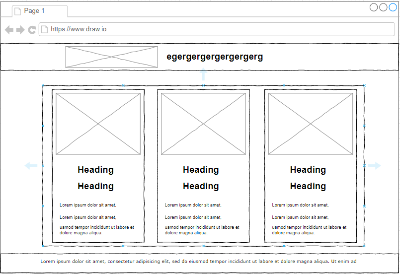
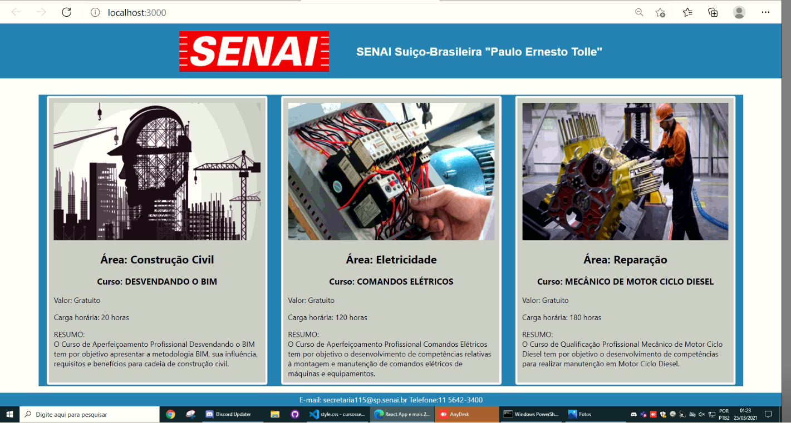

# Projeto desenvolvido utilizando React

## Objetivos do Projeto

Objetivos:
* Lapidar a construção e organização de pastas.
* Fixar a ideia de importar e exportar.
* Treinar a utilização do React.
* Treinar o funcionamento da aplicação junto ao (push e pull com o Git e GitHub.

Observações:
* Não era necessário atribuir hiperlinks nesta atividade.
#
## Planejamento

* Tarefa 1: Criar o wireframe da aplicação.
* Tarefa 2: Filtrar e escolher imagens/cursos para exibir.
* Tarefa 3: Criar pasta da aplicação/ estrutura de páginas. 
* Tarefa 4: Desenvolver código de todas as páginas.
* Tarefa 5: importar/exportar páginas.
* Tarefa 6: Visualização/aplicar CSS.
* Tarefa 7: finalização/visual.
* Tarefa 8: Criar um repositório local no Git.
* Tarefa 9: Subir o repositório local para o GitHub.
#
### `Wireframe da aplicação`
 
* Wireframe.

Todos os componentes idealizados na "Planta" do projeto.

#
### `Projeto Concluído`

* Página index da aplicação.

Projeto já finalizado. [Repositório do projeto.](https://github.com/Igor829-art/cursossenai-react-app.git)

 
  
    
### `Me Acompanhe` Informações de contato

Informações   | Contato
:------------:|--------------------------
E-mail:       |profissionaligor@gmail.com
Linkedin      |<https://www.linkedin.com/in/profissionaldevigorb7/>

